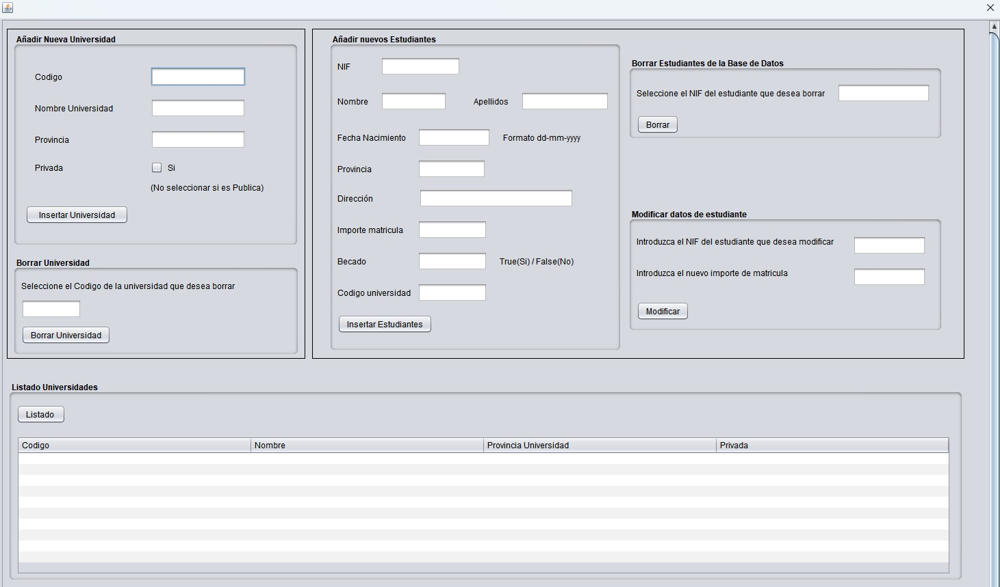
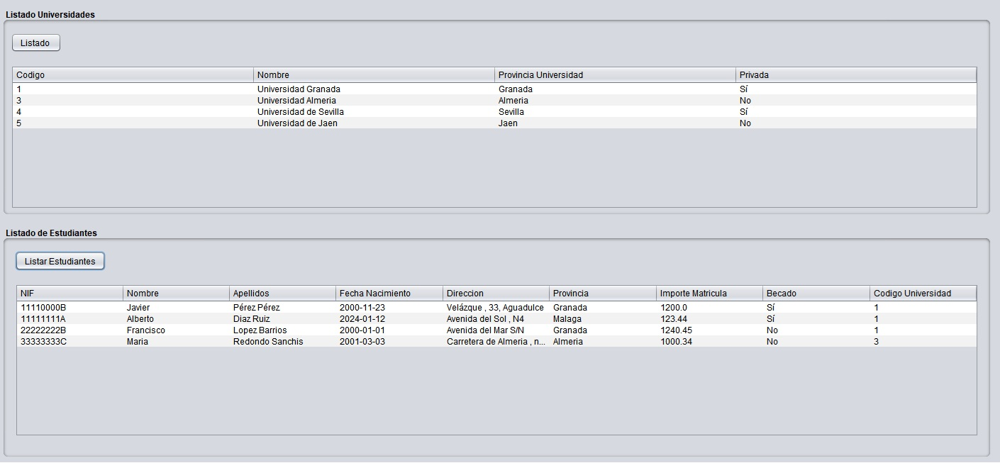
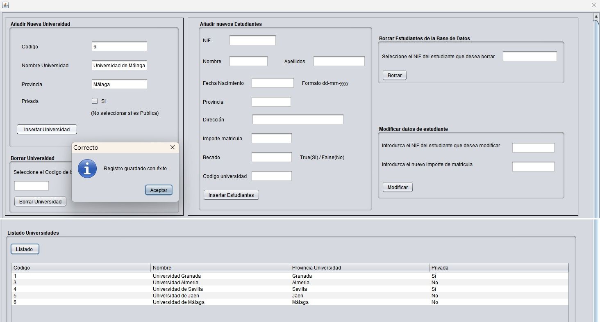
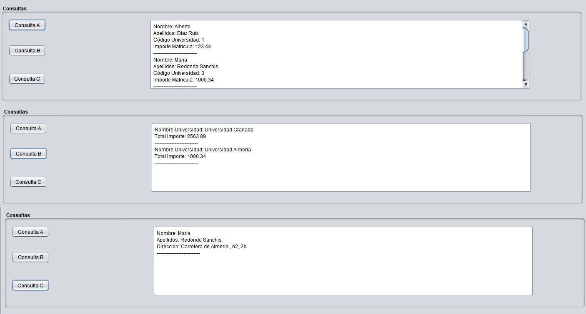
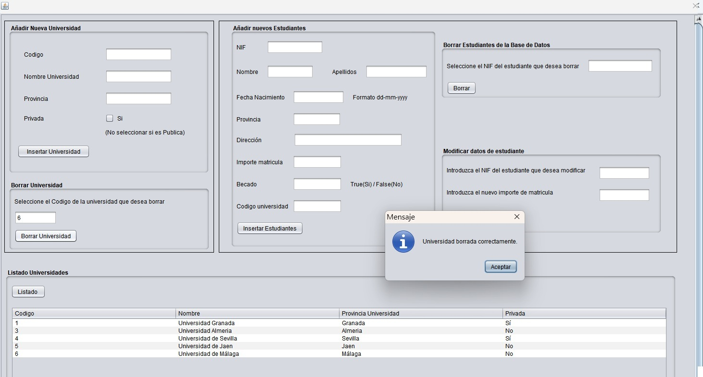

# GestionUniversidad-CRUD

Sistema de gestion universitaria que implementa un CRUD completo (Crear, Leer, Actualizar, Eliminar) para la administracion de estudiantes y universidades. Desarrollado en Java con Hibernate como ORM y Swing para la interfaz grafica, siguiendo el patron MVC.

> Desarrollado en Java como tarea de la asignatura "Acceso a Datos" del grado de Programacion Multimedia y Dispositivos Moviles.

---

## Capturas de pantalla

|                                |                                    |                                      |
|:------------------------------:|:----------------------------------:|:------------------------------------:|
|  |  |   |

|                                      |                                    |                                    |
|:------------------------------------:|:----------------------------------:|:----------------------------------:|
|  |  |  |

---

## Caracteristicas principales

### Gestion de Universidades (CRUD)
- Crear nuevas universidades con codigo, nombre, provincia y tipo (publica/privada)
- Listar todas las universidades en una tabla interactiva
- Eliminar universidades (con validacion: no permite borrar si tiene estudiantes asociados)
- Validacion de campos en tiempo real

### Gestion de Estudiantes (CRUD)
- Crear nuevos estudiantes con NIF, nombre, apellidos, fecha, direccion, provincia, importe, beca y universidad asociada
- Listar todos los estudiantes con su informacion completa (incluyendo universidad)
- Actualizar el importe de matricula de un estudiante por su NIF
- Eliminar estudiantes por su NIF
- Validacion de NIF en tiempo real (8 numeros + 1 letra mayuscula)

### Consultas Avanzadas (HQL)
- Consulta A: Nombre, apellidos, universidad e importe de matricula de los estudiantes, ordenados por importe de menor a mayor
- Consulta B: Nombre de universidad y el importe total ingresado por matriculas de alumnos
- Consulta C: Nombre, apellidos y direccion de todos los estudiantes de la provincia de 'ALMERIA' que son becados

## Tecnologias utilizadas

- Java 8 - Lenguaje de programacion
- Hibernate 4.3.1 - Framework ORM para persistencia de datos
- MySQL - Base de datos relacional
- Swing - Biblioteca para interfaces graficas (GUI)
- NetBeans GUI Builder - Diseno visual de la interfaz
- HQL (Hibernate Query Language) - Consultas orientadas a objetos
- JDBC - Conexion a base de datos

---

## Que he aprendido?
- Realizar la Base de Datos en MySql WorkBench ( previa al proyecto )
- Implementar el patron MVC en una aplicacion de escritorio
- Configurar y usar Hibernate como ORM (mapeo objeto-relacional)
- Crear archivos de mapeo XML (.hbm.xml) para las entidades
- Establecer relaciones entre entidades
- Realizar operaciones CRUD con Hibernate (save, delete, update, saveOrUpdate)
- Escribir consultas HQL avanzadas con JOIN, ORDER BY, GROUP BY y WHERE
- Disenar interfaces graficas con Swing y el GUI Builder de NetBeans
- Manejar transacciones con Hibernate (beginTransaction, commit, rollback)
- Gestionar la sesion de Hibernate (openSession, close)
- Validar datos de entrada en tiempo real (NIF, numeros, fechas)
- Implementar lazy loading con Hibernate.initialize() para relaciones
- Mostrar datos en tablas con DefaultTableModel
- Gestionar excepciones y manejo de errores
- Conectar Java con MySQL usando JDBC y Hibernate
- POJO - Clases que representan las tablas de la base de datos  (Realizada previamente en MySQL WorkBench)

---
